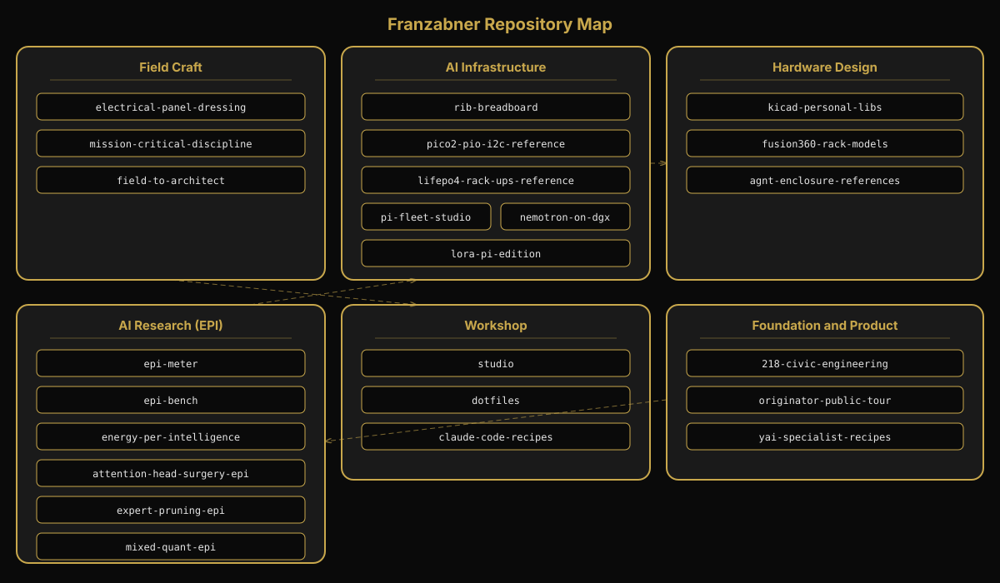
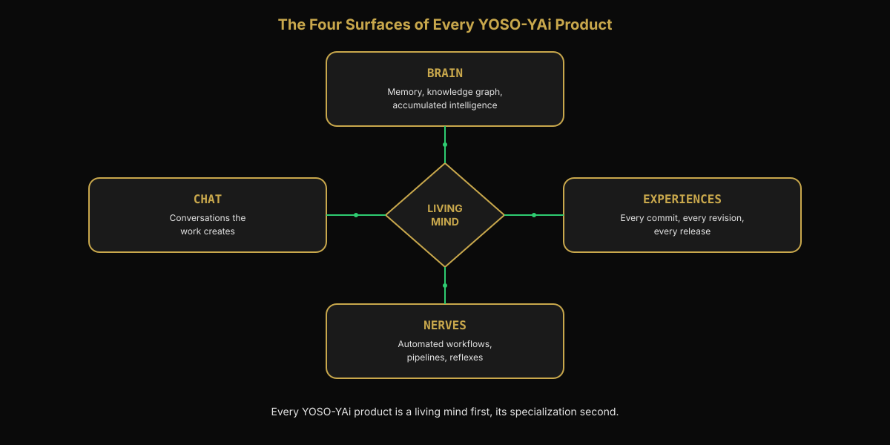
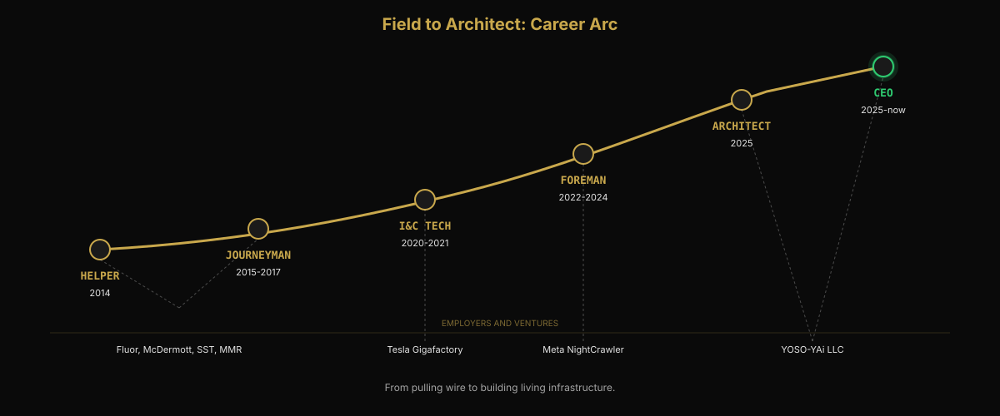

# Franzabner

### Francisco Abner Rivera. Founder and CEO, YOSO-YAi LLC. Co-Founder, 218 Network Foundation. Puerto Rico.

**The architect at the center. The discipline that scales from wire to silicon.**

---

> Active portfolio. The work compounds. Every repo is a load-bearing artifact, not a placeholder.

I architect smart AI infrastructure and smart AI power infrastructure. 12+ years in the field: helper to journeyman to I&C tech to foreman to architect, across petrochemical, LNG, automotive manufacturing, and hyperscale data center construction. The same discipline that produces a dressed panel produces a managed rack, a thermal control loop, a battery failover system. The physical and the digital are the same craft applied at different scales.

---

## The Portfolio

  

Every repo demonstrates a piece of the same discipline applied at a different scale. Field craft, AI infrastructure, hardware design, research, workshop reality. The through-line is craftsmanship: build it once, build it well, document it so the next person never has to guess.

The portfolio is the proof. Not a slide deck. Not a pitch. The work shows itself.

---

## What I Build

- Smart AI infrastructure and smart AI power infrastructure (YOSO-YAi LLC)
- Field-grade electrical and commissioning craft, documented as portfolio-grade reference
- Custom PCBs that run the firm's AI fleet (RIB, breadboard, epi-meter)
- The 12U rack where physical and digital infrastructure converge
- The career arc from helper to architect, rendered as a discipline
- Civic engineering for Puerto Rico through the 218 Network Foundation

---

## The Architectural DNA

  

Every YOSO-YAi product is a living mind first, its specialization second. Four surfaces compose the DNA: Brain (accumulated knowledge), Experiences (immutable history), Nerves (automated workflows), Chat (conversations the work creates). The 12U rack in the studio ships this pattern end to end. Every product the company designs inherits it.

---

## The Portfolio Map

### Field Craft

| Repo | What It Demonstrates |
|---|---|
| [electrical-panel-dressing](https://github.com/Franzabner/electrical-panel-dressing) | The craft that makes infrastructure live. Panel dressing, commissioning, as-built documentation. |
| [mission-critical-discipline](https://github.com/Franzabner/mission-critical-discipline) | Mission critical electrical at hyperscale. What the industry gets wrong. |
| [field-to-architect](https://github.com/Franzabner/field-to-architect) | The career arc made visible. Helper to CEO with dates and lessons. |

### AI Infrastructure

| Repo | What It Demonstrates |
|---|---|
| [rib-breadboard](https://github.com/Franzabner/rib-breadboard) | Exposed breadboard reference for the Rack Intelligence Board. Dual-processor trust boundary. |
| [pico2-pio-i2c-reference](https://github.com/Franzabner/pico2-pio-i2c-reference) | PIO state machine I2C at 400kHz. Zero CPU overhead. The silicon moat. |
| [lifepo4-rack-ups-reference](https://github.com/Franzabner/lifepo4-rack-ups-reference) | LiFePO4 battery management as rack UPS. Two-hour minimum runtime. |
| [pi-fleet-studio](https://github.com/Franzabner/pi-fleet-studio) | Bootstrap a four-Pi YAi specialist fleet. Tailscale, Forgejo, n8n, LiteLLM. |
| [nemotron-on-dgx](https://github.com/Franzabner/nemotron-on-dgx) | Running Nemotron 3 Super MoE on DGX Spark under NemoClaw. YOSOTRON. |
| [lora-pi-edition](https://github.com/Franzabner/lora-pi-edition) | LoRA fine-tuning recipes for Pi-class compute. Real ML on small silicon. |

### Hardware Design

| Repo | What It Demonstrates |
|---|---|
| [kicad-personal-libs](https://github.com/Franzabner/kicad-personal-libs) | Personal KiCad symbol and footprint libraries. Donated back to the ecosystem. |
| [fusion360-rack-models](https://github.com/Franzabner/fusion360-rack-models) | 3D models for the rack: air ducts, Pi brackets, accessories. |
| [agnt-enclosure-references](https://github.com/Franzabner/agnt-enclosure-references) | AGNT premium aluminum enclosure. Public-safe design references. |

### AI Research (EPI)

| Repo | What It Demonstrates |
|---|---|
| [energy-per-intelligence](https://github.com/Franzabner/energy-per-intelligence) | Defines the EPI metric. Joules per token divided by accuracy. |
| [epi-meter](https://github.com/Franzabner/epi-meter) | Open-source 4-channel AC power measurement board. RP2350 + CT clamps. |
| [epi-bench](https://github.com/Franzabner/epi-bench) | Tooling for EPI research. Calculator, Pareto plotter, benchmark runner. |
| [attention-head-surgery-epi](https://github.com/Franzabner/attention-head-surgery-epi) | Removing attention heads: does the energy actually drop? |
| [expert-pruning-epi](https://github.com/Franzabner/expert-pruning-epi) | MoE expert removal measured by EPI. |
| [mixed-quant-epi](https://github.com/Franzabner/mixed-quant-epi) | Per-layer quantization evaluated by EPI. |

### Workshop

| Repo | What It Demonstrates |
|---|---|
| [studio](https://github.com/Franzabner/studio) | The 12U rack where physical and digital infrastructure converge. |
| [dotfiles](https://github.com/Franzabner/dotfiles) | Terminal config, Claude Code presets, Cursor rules, Tailscale snippets. |
| [claude-code-recipes](https://github.com/Franzabner/claude-code-recipes) | Claude Code project configs and workflow patterns from daily use. |

### Foundation and Product

| Repo | What It Demonstrates |
|---|---|
| [218-civic-engineering](https://github.com/Franzabner/218-civic-engineering) | Civic engineering methodology. NEURONAs, closed-loop supply chain. |
| [originator-public-tour](https://github.com/Franzabner/originator-public-tour) | Public-safe walkthrough of The Originator's architecture. |
| [yai-specialist-recipes](https://github.com/Franzabner/yai-specialist-recipes) | Methodology behind forging a YAi specialist. |

---

## From Field to Architect

  

The arc starts with pulling wire. Fluor Corporation, McDermott, SST, MMR. Conduit bending, raceway installation, learning to read prints. Then instrumentation and controls at Tesla's Gigafactory: sensor integration, PLC logic, the transition from power to controls. Then foreman at Meta NightCrawler: running crews, managing quality on mission-critical electrical infrastructure where a single fault means millions in downtime.

The arc ends with designing the systems instead of installing them. KiCad for electrical, Fusion 360 for mechanical, NVIDIA Omniverse for spatial composition. The same person who dressed panels at Tesla now designs the Rack Intelligence Board. The same discipline that keeps a 480V switchgear from faulting keeps an AI fleet thermally stable. The craft scales. The posture does not change.

---

## The Stack

| Layer | Tool or Standard |
|---|---|
| Hardware design | KiCad 9.0, Fusion 360, NVIDIA Omniverse |
| Firmware | C, Pico SDK, RP2350A (PIO state machines) |
| AI infrastructure | NVIDIA DGX Spark, Jetson Orin Nano, Pi 5 fleet, YAITRON hubs |
| AI reasoning | Claude Opus 4.6 (Claude Code), Cursor (Sonnet 4.6) |
| Web | Next.js, MDX, Tailwind, Vercel |
| Source of truth | Forgejo (private), GitHub (selective public mirror) |
| Network | Tailscale (the only plane, no public exposure) |
| Brand | Inter, JetBrains Mono, locked dark palette (#0A0A0A, #C9A84C, #2ECC71) |
| Field standards | NEC 2023, NFPA 70E, UL 508A, UL 67, IEEE C2, OSHA 1910.147 |

---

## Where to Find the Work

| Surface | Link |
|---|---|
| Company | [yoso-yai.com](https://yoso-yai.com) |
| YOSOR | [yosor.app](https://yosor.app) |
| Foundation | [218.network](https://218.network) |
| Hugging Face | [huggingface.co/Franzabner](https://huggingface.co/Franzabner) |
| Instagram | [@franzabner](https://instagram.com/franzabner) |
| TikTok | [@franzabner](https://tiktok.com/@franzabner) |
| Personal Upwork | [upwork.com/freelancers/~0190520c10612c54b4](https://upwork.com/freelancers/~0190520c10612c54b4) |
| Agency Upwork | [upwork.com/agencies/2036580282949929383](https://upwork.com/agencies/2036580282949929383) |

---

## About YOSO-YAi LLC

YOSO-YAi is an infrastructure-tech company. We design, research, develop, and innovate smart AI infrastructure and smart AI power infrastructure. The same craft mindset that produces a dressed panel produces a managed rack, a thermal control loop, a battery failover system. The company was founded by someone who pulled wire before writing firmware. The physical discipline and the digital discipline are the same discipline applied at different scales. [yoso-yai.com](https://yoso-yai.com)

---

## Refusals

- No Twitter/X.
- No LinkedIn.
- The work shows itself, not the brand.

---

## License

MIT License. Copyright 2026 Francisco Abner Rivera, YOSO-YAi LLC. See [LICENSE](LICENSE).
